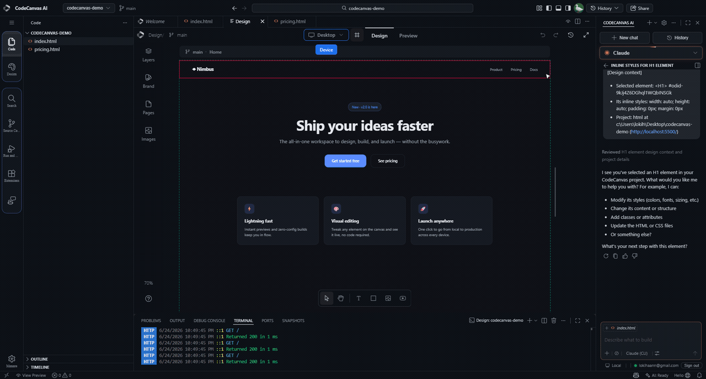
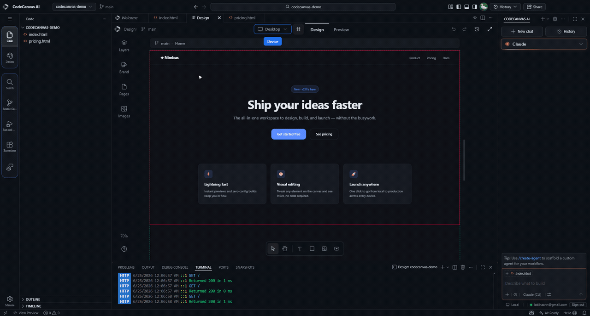
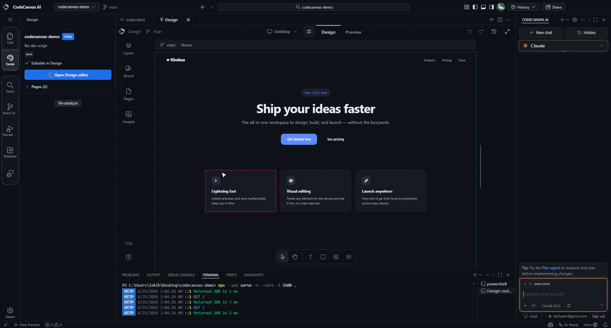
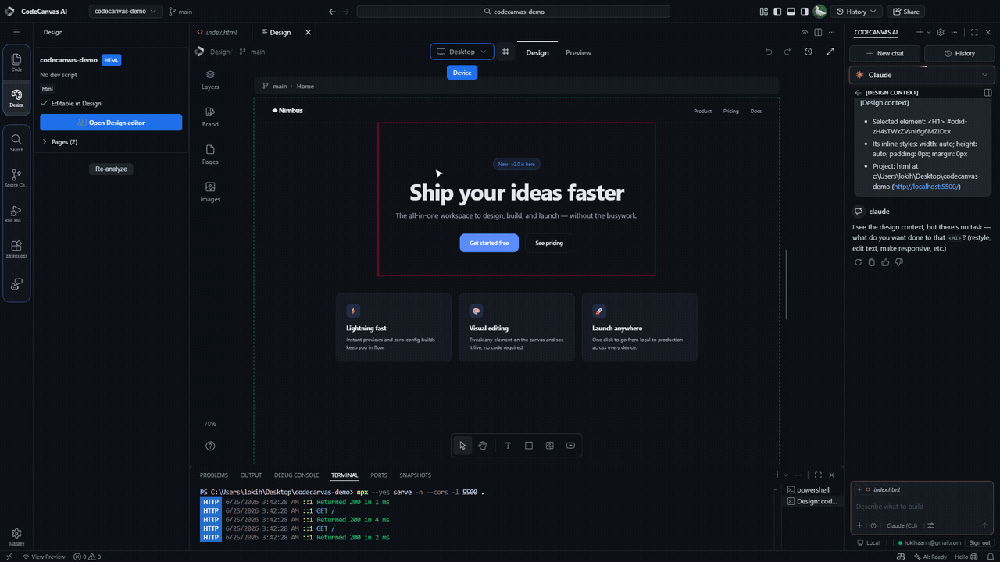
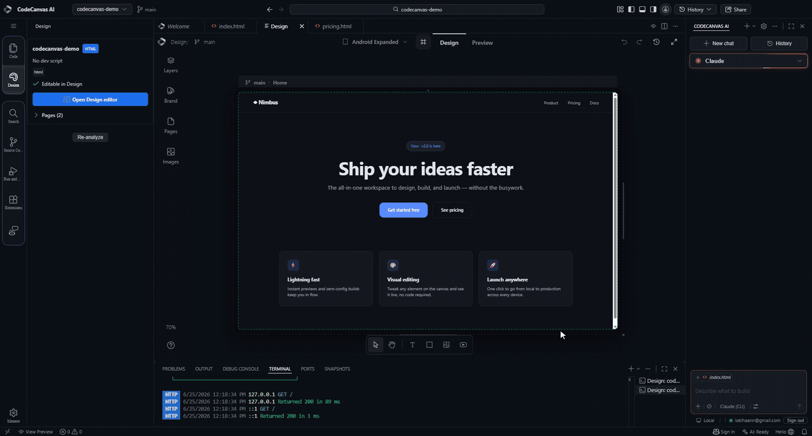

<div align="center">


# CodeCanvas AI

### A visual-first code editor — design on a live canvas, with an AI that knows exactly what you mean. Your code stays the source of truth.

[](https://github.com/FaridDevU/CodeCanvas-AI/releases)


[**Website**](https://getcodecanvas.dev) · [**Download (alpha)**](https://github.com/FaridDevU/CodeCanvas-AI/releases) · [**Report a bug**](https://github.com/FaridDevU/CodeCanvas-AI/issues)

</div>

<div align="center">
  
</div>

---

## What is it?

CodeCanvas AI is a desktop editor — a fork of VS Code OSS (Electron) — with a visual **Design** environment. Open a project, edit it directly on a **live canvas** (text, layout, styles), and every change is written back to the **real source files**. The code is always the source of truth; the canvas is a view onto it.

Design, build, and talk to an AI agent in the same window — no round-tripping between a design tool and an editor.

---

## Features

Everything below is captured from the real, compiled app — no mockups.

### Edit on the canvas
Select any element on the canvas, change its text, and the live preview updates instantly. No code, no rebuilds.

<div align="center"></div>

### Design for every screen
One project, every screen. Switch from desktop to phone in a single click and the canvas reflows into a real device frame — so you know exactly how it looks before you ship.

<div align="center"></div>

### AI that knows what you mean
Pick an element, right-click, and send it straight to the AI — with its tag, its inline styles, and its source file already attached. Your assistant always knows exactly what you're pointing at.

<div align="center"></div>

### Live preview, side by side
Every change is live. Edit on the canvas and see the real, running page update in the same window — exactly what your users will get.

<div align="center"></div>

### Inspect and tweak anything
Click any element to select it — a heading, a card, a button. Its full style panel is right there: font, size, color, spacing. Inspect and fine-tune in seconds.

<div align="center"></div>

---

## Quickstart

1. **Download** the installer from [Releases](https://github.com/FaridDevU/CodeCanvas-AI/releases) — `CodeCanvasAISetup.exe` (Windows x64).
2. **Run it.** It's an unsigned alpha, so Windows SmartScreen will warn — choose **More info**, then **Run anyway**. User-scoped install, no admin needed.
3. **Open a folder** (an HTML project), then click **Design** in the activity bar to open the canvas.
4. **Edit visually** on the canvas, and chat with the **Claude** agent docked on the right.

---

## Why CodeCanvas AI?

- **Code is the source of truth** — the canvas edits your real files, not a throwaway mockup that drifts from the code.
- **Design, build and AI in one window** — stop bouncing between a design tool and an editor.
- **AI with real context** — every element you send carries its tag, styles, and source path, so the agent never guesses.
- **Built on VS Code** — the full editor you already know, with a visual layer on top.

---

## Stack

| Layer          | Tech                                              |
|----------------|---------------------------------------------------|
| Base           | VS Code OSS + Electron                             |
| Language       | TypeScript                                         |
| Design editor  | Vite + React (live canvas, inspector, write-back)  |
| AI agent       | Claude (via the Claude CLI)                        |
| Platform       | Windows x64 (alpha)                                |

---

## Build from source

Requires Node 20+ and the repo's build dependencies. On Windows, `signtool.exe` (Windows SDK) must be on `PATH` for the packaging step.

```bash
npm install

# Build the app -> ../VSCode-win32-x64/CodeCanvas AI.exe
npm run gulp vscode-win32-x64-min

# Build the installer -> .build/win32-x64/user-setup/CodeCanvasAISetup.exe
npm run gulp vscode-win32-x64-inno-updater
npm run gulp vscode-win32-x64-user-setup
```

For day-to-day development of the workbench, use `npm run watch-client` and launch with `scripts\code.bat`.

---

## Status

**Alpha.** Working today: the Design canvas (edit, device frames, inspect, live preview, write-back to source, undo) and the **Claude** AI agent.

Coming soon:

- Copilot, Codex and Kimi agents
- Code signing (removes the SmartScreen warning)
- macOS and Linux builds
- Full localization (a few panels are still mixed-language)

---

## License

Distributed under the [MIT License](LICENSE.txt). CodeCanvas AI is a fork of [VS Code OSS](https://github.com/microsoft/vscode) (Microsoft, MIT).

<div align="center">
<sub>Built on the canvas. <a href="#codecanvas-ai">Back to top</a></sub>
</div>
